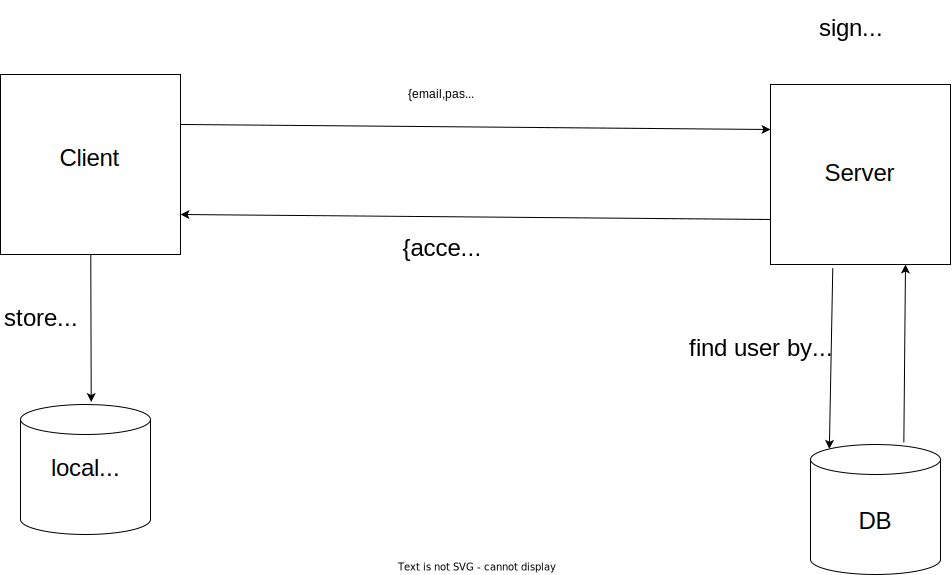
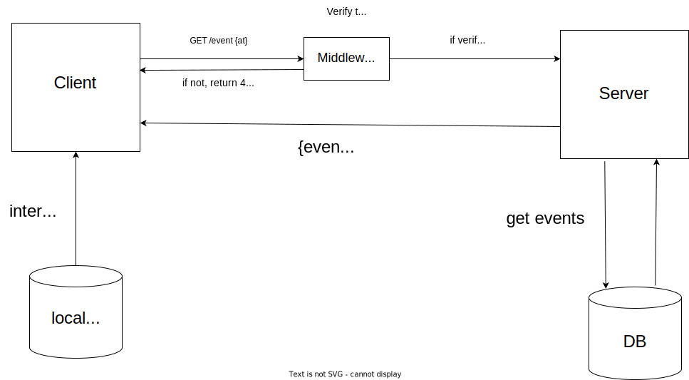

# Event App Manager API

## Description

REST API for Event Managment App

## Table of contents

- [Technologies](#technologies)
- [Requirements](#requirements)
- [Usage](#usage)
- [API endpoints](#api-endpoints)
- [DB](#db)
- [JWT](#jwt)
- [Tests](#tests)

## Technologies

- `node`
- `express`
- `supertest`

## Requirements

- install `node`
- install `mongodb`

## Usage

### Clone repository

```
git clone https://github.com/wojciechszmelczerczyk/node-api-event-manager.git
```

### Navigate to project folder

```sh
cd /node-api-event-manager
```

### Install dependencies

```
npm i
```

#### Run Express REST API

```sh
npm run dev
```

### Env setup

```dockerfile
# Uri to mongo database
DB_URI=

# Port
PORT=

# Arbitrary access token for testing purposes (no expiration time)
AT=

# Arbitrary invalid access token for testing purposes
INVALID_AT=

# Arbitrary expired access token for testing purposes
EXPIRED_AT=

# Arbitrary refresh token for testing purposes (no expiration time)
RT=

# Arbitrary invalid refresh token for testing purposes
INVALID_RT=

# secret
SECRET=

```

## API endpoints

### User:

| Method |                     Endpoint                     |
| :----: | :----------------------------------------------: |
|  POST  |          [`/user`](./docs/user/post.md)          |
|  POST  | [`/user/authenticate`](./docs/user/post-auth.md) |
|  GET   |    [`/user/refreshToken`](./docs/user/get.md)    |

### Event:

| Method |                  Endpoint                  |
| :----: | :----------------------------------------: |
|  GET   |      [`/event`](./docs/event/get.md)       |
|  POST  |      [`/event`](./docs/event/post.md)      |
|  GET   | [`/event/:title`](./docs/event/getById.md) |
| DELETE |   [`/event/:id`](./docs/event/delete.md)   |

## DB

Database contains of User and Event collections.

### User

[](https://mermaid.live/edit#pako:eNptj70KwzAMhF_FaM4TeG7XLqGbF2ErqWlsB1mmlJB3r8jPEqpF4uPuOC3gSyCw4Ces9RZxZEwuG52NmGclXnZgTC8c82iGyFUemOjC1fAPU8I4Xdis2Z_CYcfrtk7JPtBBIlZr0HZbAwfyIk0Hq2dAfjtweVVdmwMK3UOUwmAHnCp1gE1K_80erHCjU3R8eKjWH1d7Ub8)

### Event

[](https://mermaid.live/edit#pako:eNptkDsOgzAMhq8SeeYEmWHtQscsFjE0KgmVYypViLvXvFoV1Yutz7-fEzSDJ7DQ9JhzGbBjjC4ZtZWY6klJpo0YUwuH1Jk2cJYLRjpxrfiHKWLoz2zpew3Sf8QlCpksyLJEP5SS_7J5dUd-MyggEusYr6es2zqQG-kmYDX0yHcHLs2qGx9eW1U-yMBgW-wzFYCjDPUrNWCFRzpE-zt21fwGxZhfhA)

## JWT

### Token implementation

When user login, api return access token and refresh token.



Every protected api endpoint include middleware which verify token.

Access token is intercepted from local storage and used in auth header.



### Create new token helper function

#### Sign token with user credentials ie. first name, last name and email.

```javascript
export const createToken = (payload, secret, expTime) =>
  sign(payload, secret, { expiresIn: expTime });
```

## Tests

### To run tests

`npm run test`

### Flush document

When tests finished, delete most recent document from db

```javascript
export const flushLastDocument = async (Model) =>
  await Model.findOneAndDelete({}, { sort: { _id: -1 } });
```

### Data

Sample of data used in tests. All necessary data is imported as json module.

```json
[
  {
    "firstName": "first name",
    "lastName": "last name",
    "email": "test@gmail.com",
    "password": "test123"
  }
]
```

### User

#### `POST /user`

<details>
<summary>when all credentials correct, should create user</summary>

```javascript
it("when all credentials correct, should create user", async () => {
  const newUser = await request(app).post("/user").send(users[0]);

  // find created user in database
  const userFromDb = await User.findById(newUser.body._id);

  // if user credentials are correct, shouldn't be any error response back
  expect(newUser.error).not.toBeTruthy();

  // user should exist
  expect(userFromDb).toBeTruthy();
});
```

</details>

<details>
<summary>when email doesn't match email regex, should return an error message</summary>

```javascript
it("when email doesn't match email regex, should return an error message", async () => {
  const errData = await request(app).post("/user").send(users[1]);
  expect(errData.error).toBeTruthy();
  expect(errData.text).toBe(
    "user validation failed: email: Please enter a valid email"
  );
});
```

</details>

<details>
<summary>when no email provided, should return an error message</summary>

```javascript
it("when no email provided, should return an error message", async () => {
  const errData = await request(app).post("/user").send(users[2]);
  expect(errData.error).toBeTruthy();
  expect(errData.text).toBe(
    "user validation failed: email: Please enter an email"
  );
});
```

</details>

<details>
<summary>when provided password is shorter than 6, should return an error message</summary>

```javascript
it("when provided password is shorter than 6, should return an error message", async () => {
  const errData = await request(app).post("/user").send(users[3]);
  expect(errData.error).toBeTruthy();
  expect(errData.text).toBe(
    "user validation failed: password: Password is too short. Minimum length is 6 characters"
  );
});
```

</details>
<br/>

#### `POST /user/authenticate`

<details>
<summary>when provided user credentials match with user from db, return access token and refresh token</summary>
 
 ```javascript
 it("when provided user credentials match with user from db, return access token and refresh token", async () => {
    const { body } = await request(app)
      .post("/user/authenticate")
      .send(users[0]);
    expect(body.accessToken && body.refreshToken).toBeTruthy();
  });
  ```
</details>
<details>
<summary>when email doesn't match email regex, should return an error message</summary>

```javascript
it("when email doesn't match email regex, should return an error message", async () => {
  const errData = await request(app).post("/user/authenticate").send(users[1]);

  expect(errData.error).toBeTruthy();
  expect(errData.text).toBe(
    "Provide correct email. User with this email doesn't exist"
  );
});
```

</details>
<details>
<summary>when no email provided, should return an error message</summary>

```javascript
it("when no email provided, should return an error message", async () => {
  const errData = await request(app).post("/user/authenticate").send(users[2]);

  expect(errData.error).toBeTruthy();
  expect(errData.text).toBe("Please enter an email");
});
```

</details>
<details>
<summary>when provided password is incorrect, should return an error message</summary>

```javascript
it("when provided password is incorrect, should return an error message", async () => {
  const errData = await request(app).post("/user/authenticate").send(users[3]);

  expect(errData.error).toBeTruthy();
  expect(errData.text).toBe("Provide correct password. Password incorrect");
});
```

</details>
<br />

#### `POST /user/refreshToken`

<details>
<summary>when refresh token is verified, return new access token and refresh token</summary>

```javascript
it("when refresh token is verified, return new access token and refresh token", async () => {
  const newTokens = await request(app)
    .post("/user/authenticate")
    .set("Authorization", `Bearer ${process.env.RT}`);

  expect(newTokens).toBeTruthy();
});
```

</details>

<details>
<summary>when refresh token is invalid, should return an error message</summary>

```javascript
it("when refresh token is invalid, should return an error message", async () => {
  const err = await request(app)
    .post("/user/authenticate")
    .set("Authorization", `Bearer ${process.env.INVALID_RT}`);

  expect(err).toBeTruthy();
});
```

</details>

<details>
<summary>when refresh token doesn't exist, should return an error message</summary>

```javascript
it("when refresh token doesn't exist, should return an error message", async () => {
  const err = await request(app).post("/user/authenticate");

  expect(err).toBeTruthy();
});
```

</details>

<br/>

### Event

#### `POST /event/create`

<details>
<summary>when jwt is verified and event data payload is correct, should create new event</summary>
 
 ```javascript
it("when jwt is verified and event data payload is correct, should create new event", async () => {
    const newEvent = await request(app)
      .post("/event/create")
      .set("Authorization", `Bearer ${process.env.AT}`)
      .send(events[0]);

    // event should exist
    const eventFromDb = await Event.findById(newEvent.body.event);

    expect(eventFromDb).toBeTruthy();

});

````
</details>

<details>
<summary>when jwt is verified and event data payload is incorrect, should return error message</summary>

 ```javascript
 it("when jwt is verified and event data payload is incorrect, should return error message", async () => {
    const newEvent = await request(app)
      .post("/event/create")
      .set("Authorization", `Bearer ${process.env.AT}`)
      .send(events[1]);

    expect(newEvent.error).toBeTruthy();
  });

</details>

<details>
<summary>when jwt is invalid, should return error message</summary>

```javascript
it("when jwt is invalid, should return error message", async () => {
  const newEvent = await request(app)
    .post("/event/create")
    .set("Authorization", `Bearer ${process.env.INVALID_JWT}`)
    .send(events[1]);

  expect(newEvent.text).toBe("jwt malformed");
});
```

</details>

<details>
<summary>when jwt has expired, should return error message</summary>

```javascript
it("when jwt has expired, should return error message", async () => {
  const newEvent = await request(app)
    .post("/event/create")
    .set("Authorization", `Bearer ${process.env.EXPIRED_JWT}`)
    .send(events[1]);

  expect(newEvent.text).toBe("jwt expired");
});
```

</details>
<br/>

#### `GET /event`

<details>
<summary>when jwt correct, should return all current user events</summary>

```javascript
it("when jwt correct, should return all current user events", async () => {
  const events = await request(app)
    .get("/event")
    .set("Authorization", `Bearer ${process.env.JWT}`);

  expect(events.body).toBeTruthy();
});
```

</details>

<details>
<summary>when jwt inccorrect, should return error message</summary>

```javascript
 it("when jwt inccorrect, should return error message", async () => {
    const events = await request(app)
      .get("/event")
      .set("Authorization", `Bearer ${process.env.INVALID_AT}`);

    expect(events.text).toBe("jwt malformed");
  });
```

</details>

<details>
<summary>when jwt expired, should return error message</summary>

```javascript
it("when jwt expired, should return error message", async () => {
    const events = await request(app)
      .get("/event")
      .set("Authorization", `Bearer ${process.env.EXPIRED_AT}`);

    expect(events.text).toBe("jwt expired");
  });
```

</details>

<br />

#### `GET /event/:title`

<details>
<summary>when jwt correct, should return specific event of current user</summary>

 ```javascript
it("when jwt correct, should return specific event of current user", async () => {
    const title = events[0].eventTitle;

    const event = await request(app)
      .get(`/event/${title}`)
      .set("Authorization", `Bearer ${process.env.AT}`);

    const isExist = await Event.findById(event.body._id);

    expect(isExist).toBeTruthy();

});

````

</details>

<details>

<summary>when jwt inccorrect, should return error message</summary>

```javascript
it("when jwt inccorrect, should return error message", async () => {
  const title = events[0].eventTitle;

  const event = await request(app)
    .get(`/event/${title}`)
    .set("Authorization", `Bearer ${process.env.INVALID_AT}`);

  expect(event.text).toBe("jwt malformed");
});
```

</details>

<details>
<summary>when jwt expired, should return error message</summary>

```javascript
it("when jwt expired, should return error message", async () => {
  const title = events[0].eventTitle;

  const event = await request(app)
    .get(`/event/${title}`)
    .set("Authorization", `Bearer ${process.env.EXPIRED_AT}`);

  expect(event.text).toBe("jwt expired");
});
```

</details>
